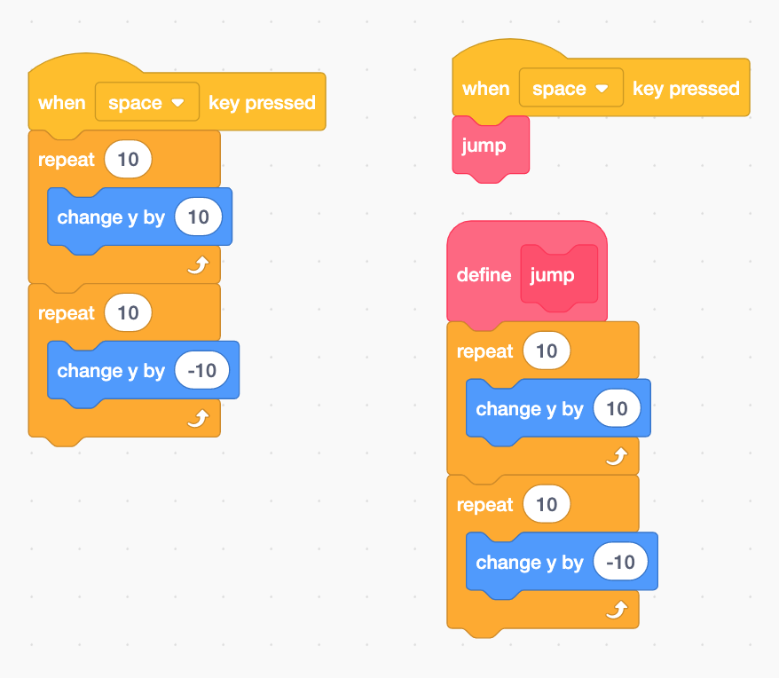
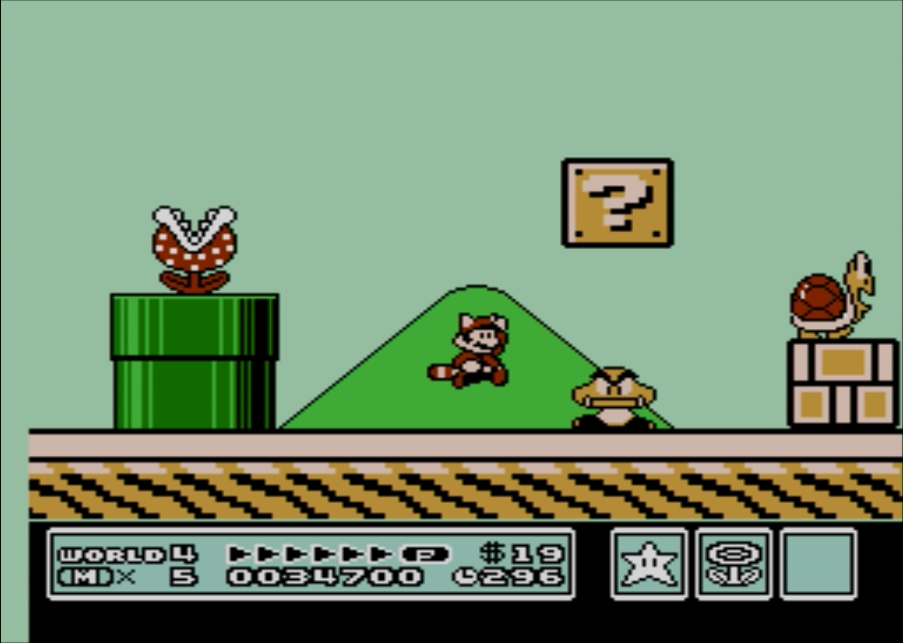

# Activity/Standard Match

## 7-8.CT.4
Write a program using functions or procedures whose names or other documentation convey their purpose within the larger task.

### Activity
This standard could be addressed by a refactoring activity where students are given an existing project and asked to refactor it. By replacing dense or repeated patterns with functions, students can build their own understanding of the utility of functions. 
In Scratch, scripts tend to become bloated with lots of code blocks and it is hard to see what is happening. For example a simple jump pattern can be grouped in a function called "jump." This cleans up the code, making it easier to comprehend/debug.
 

After a code demo of how to use a "My Block" in scratch to create a function, students could do a pairing activity where they are given "Spaghetti" code for a sprite and asked to refactor it using function blocks. Students could then share with out pairs there refactored code, noting similarities and differences.

### Rationale
I've found that at first it is difficult for students to grasp the utility of functions until they have seen code NOT using functions side by side with code organized around functions. Refactoring gives a authentic use case of taking messy code and cleaning it up with functions. 

## 7-8.CT.7
Design or remix a program that uses a variable to maintain the current value of a key piece of information.

### Activity
To address this standard I would have students create a simple click game using scratch or p5.js.
After given a simple definition, "variables are a way to store information throughout a program," I'd ask student to as many variables as they can from a screenshot of a familiar video game. 

 

Next, I'd have students create a simple click game, where each time a sprite is clicked the score increases. I'd model the first step of creating and naming a variables, asking for student input on a good name.
As a challenge students could create another variable for time and use it for creating countdown timer to stop the game.

### Rationale
Games are a natural case where students are able to understand what variables are, since they often contain data like lives, score, and time variables.
